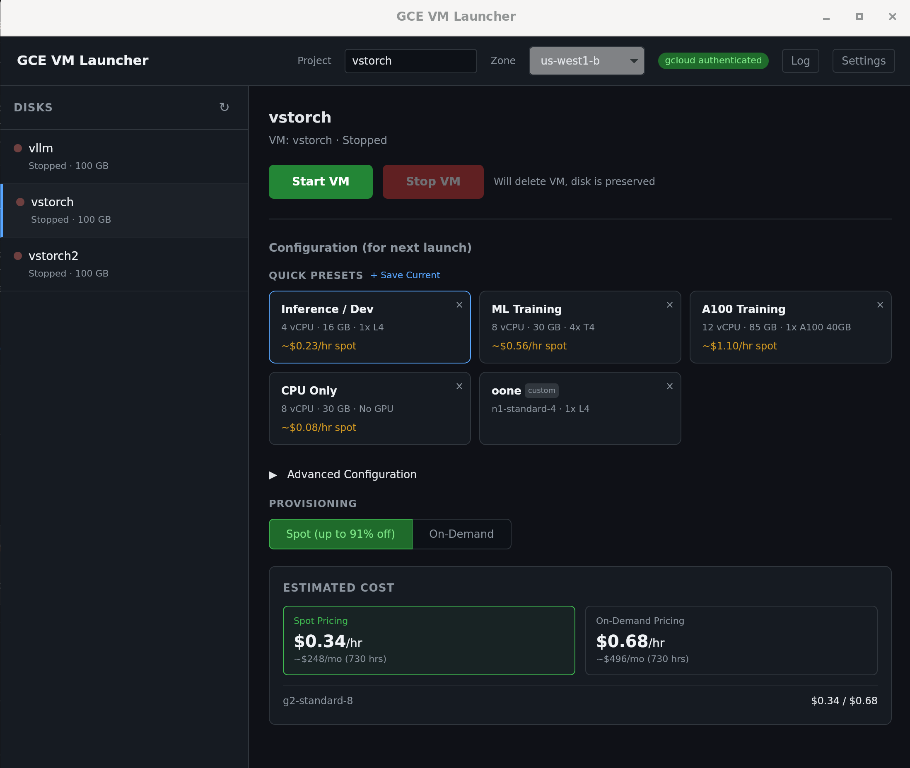

# GCE VM Launcher

A lightweight desktop app for managing Google Compute Engine virtual machines with persistent disks — built for ML and AI workloads.



## Why?

Running GPU workloads on GCE means juggling `gcloud` commands to create VMs, attach disks, configure SSH, and track costs. GCE VM Launcher wraps all of that into a single dashboard so you can spin up a GPU instance, connect via SSH, and tear it down when you're done — without losing your disk.

## Key Ideas

- **Disks are durable, VMs are ephemeral.** Your boot disk persists across VM lifecycles. Create a VM when you need compute, delete it when you're done, and your data stays intact.
- **Spot-first pricing.** VMs default to spot provisioning to minimize cost, with easy toggle to on-demand.
- **Automatic SSH config.** After a VM starts, the app runs `gcloud compute config-ssh` so you can immediately `ssh` into the instance or connect via VS Code Remote.

## Features

- **Disk dashboard** — list, select, and manage persistent disks
- **One-click VM lifecycle** — create and delete VMs attached to a selected disk
- **Machine presets** — quick-select cards for common configs (G2 + L4, N1 + T4, A2 + A100, CPU-only) plus advanced manual configuration
- **GPU support** — N1 with attachable GPUs (T4, V100, P100, P4) and machine families with built-in GPUs (G2/L4, A2/A100, A3/H100)
- **Cost estimation** — spot and on-demand hourly rates with monthly projections, works offline
- **Live status monitoring** — 5-second polling with color-coded indicators (green = running, yellow = transitioning, red = stopped)
- **Resource summary** — CPU, memory, GPU, and provisioning model at a glance
- **Settings persistence** — project, zone, machine type, and preferences saved across restarts

## Prerequisites

### 1. Google Cloud SDK (`gcloud`)

Install the [Google Cloud CLI](https://cloud.google.com/sdk/docs/install):

```bash
# Debian / Ubuntu
sudo apt-get install google-cloud-cli

# macOS (Homebrew)
brew install --cask google-cloud-sdk

# Or download from https://cloud.google.com/sdk/docs/install
```

### 2. Authenticate and configure a project

```bash
# Log in to your Google account
gcloud auth login

# Set your default project
gcloud config set project YOUR_PROJECT_ID

# Set a default zone (pick one with the GPUs you need)
gcloud config set compute/zone us-central1-a
```

You can also configure the project and zone inside the app's settings panel.

### 3. Enable the Compute Engine API

```bash
gcloud services enable compute.googleapis.com --project YOUR_PROJECT_ID
```

### 4. GPU quota

If you plan to use GPU instances, make sure you have quota for the GPU type in your target region. Check at **IAM & Admin → Quotas** in the GCP Console, filtering for the GPU metric (e.g., `NVIDIA_L4_GPUS` or `PREEMPTIBLE_NVIDIA_L4_GPUS`). Request an increase if your limit is 0.

## Development Setup

### Requirements

- [Rust](https://rustup.rs/) (stable)
- [Node.js](https://nodejs.org/) (v18+)
- [Tauri 2 prerequisites](https://v2.tauri.app/start/prerequisites/) (system dependencies for your OS)

### Run in dev mode

```bash
npm install
cargo tauri dev
```

This starts the Vite dev server on port 1420 and launches the Tauri desktop window with hot reload.

### Run tests

```bash
# Rust backend tests
cd src-tauri && cargo test

# Frontend lint
npm run lint
```

### Build for production

```bash
cargo tauri build
```

## Tech Stack

| Layer | Technology |
|-------|-----------|
| Desktop shell | Tauri 2.x (Rust) |
| Frontend | React 19 + TypeScript + Tailwind CSS |
| Build | Vite |
| GCE integration | gcloud CLI (shelled out from Rust) |

## Contributing

This project is in early development. Feedback, feature requests, and pull requests are welcome!

- **Feature requests & bugs** — open an [issue](https://github.com/rstager/cgelauncher/issues)
- **Pull requests** — fork the repo, create a branch, and submit a PR
- **Questions & ideas** — start a [discussion](https://github.com/rstager/cgelauncher/discussions)

## License

See [LICENSE](LICENSE) for details.
